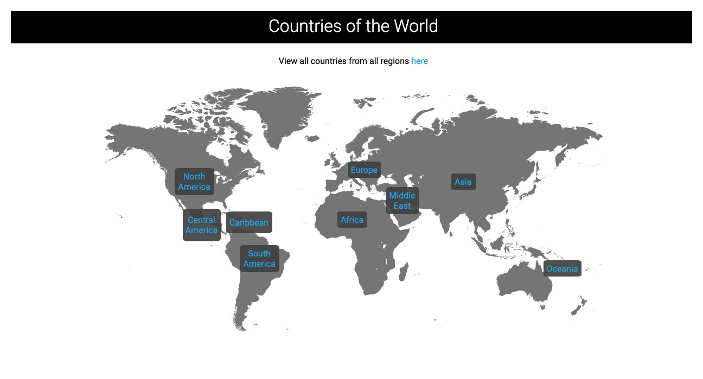

# Countries API

## Objective
The objective of this project was to create a REST API that returns information for all countries in the world, by their geographic region. There are 9 geographic regions used in this API. Each of which are given an ID # in the database:

1 - North America

2 - Central America

3 - Caribbean

4 - South America

5 - Europe

6 - Africa

7 - Middle East

8 - Asia

9 - Oceania

## Structure & Functionality
This API utilizes a MySQL database to store the country data, as well as a Pug frontend for the rendering.

The database contains a 2 data tables and a linking table. The application uses the Sequelize ORM to connect to the database and it is then parsed into JSON format.

The frontend of the application utilizes the Pug template-engine as well CSS for styling. All images used are stored in the public/images folder of the repo.

## API Documentation

The following HTTP methods are implemented: GET & POST.

#### GET METHOD

http://localhost:1400/api/countries

GET - Returns a list in raw JSON of all countries and their information currently in the database in Alphabetical order.

    {

    },
    
http://localhost:1400/api/countries/:name
    
GET - Returns a specific country or list of all countries and their information cirrently in the database by fuzzy match params in raw JSON.

    {

    },
    
http://localhost:1400/api/region/:id
    
GET - Returns a list of countries in raw JSON by their region ID #.

    {

    },

#### POST METHOD

http://localhost:1400/api/countries

POST - Adds a new student to the database. A new Student ID is created in sequential order.

    {

    }

## To View the Frontend

Main Route
http://localhost:1400/

View All Countries
http://localhost:1400/countries

View a Specific Country From All Countries with Fuzzy Match Params
http://localhost:1400/countries/:name

View All Countries From a Specific Region
http://localhost:1400/region/north_america

View a Specific Country From a Specific Region with Fuzzy Match Params
http://localhost:1400/region/north_america/:name
